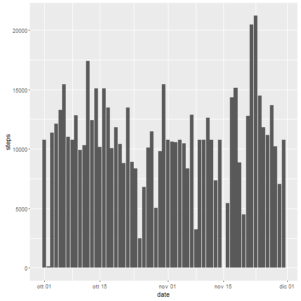

## Loading and preprocessing the data

```r
library("data.table")
library("ggplot2")
library("dplyr")
```


```r
act<-read.csv("activity.csv")
act2 <- data.table(act)
act2<-act2[,list(steps=sum(steps, na.rm=TRUE)), by='date']# data aggregated by date
act2$date<-as.Date(act2$date)
plotst<-ggplot(act2, aes(x=date, y=steps))
plotst+geom_bar(stat="identity",aes())#histogram of steps/day with ggplot 
```


## What is mean total number of steps taken per day?


```r
mean(act2$steps, na.rm=TRUE)#mean
```

```
## [1] 9354.23
```

```r
median(act2$steps, na.rm=TRUE)#median
```

```
## [1] 10395
```


## What is the average daily activity pattern?


```r
act3<-data.table(act)
MeanStepsInt<-act3[,list(steps=mean(steps, na.rm=TRUE)), by='interval']
#plot(MeanStepsInt$steps, type="l") graph with plot function (for reference only) 
plotst2<-ggplot(MeanStepsInt, aes(x=interval, y=steps))
plotst2+geom_line(aes())
```


```r
MeanStepsInt[which.max(MeanStepsInt$steps),]# interval with highest average number of steps 
```

```
##    interval    steps
## 1:      835 206.1698
```

## Imputing missing values

```r
act$ID<-(1:length(act$steps))#add a unique key
NAact<-filter(act, is.na(steps))#table of the intervals with NA values
NAactFill<-merge(NAact,round(MeanStepsInt), by="interval",all=TRUE) #merge that table with the means for those intervals (rounded)

actnoNA<-merge(act, NAactFill, by="ID",all.x=TRUE) #add NAactFIll to the original dataset, thanks to the univoque ID
actnoNA<-arrange(actnoNA, date.x)

actnoNA$steps[is.na(actnoNA$steps)]<-(actnoNA$steps.y[is.na(actnoNA$steps)])#replace NA in steps with values in steps.y (the average steps for that intervall across all the sample)

actnoNA<-select(actnoNA, -(interval.y:steps.y))#get rid of redundant columns
actnoNA<- rename(actnoNA, date=date.x, interval=interval.x)#rename columns for clarity


actnoNA <- data.table(actnoNA)

ActDateNoNA<-actnoNA[,list(steps=sum(steps)), by='date']
ActIntervalNoNA<-actnoNA[,list(steps=sum(steps)), by='interval']

ActDateNoNA$date<-as.Date(act2$date)
plotst<-ggplot(ActDateNoNA, aes(x=date, y=steps))
plotst+geom_bar(stat="identity",aes())
```



```r
mean(ActDateNoNA$steps)
```

```
## [1] 10765.64
```

```r
median(ActDateNoNA$steps)
```

```
## [1] 10762
```


## Are there differences in activity patterns between weekdays and weekends?

```r
actnoNA$date<-as.Date(actnoNA$date)
actnoNA$wday<-weekdays(actnoNA$date, abbreviate=TRUE)#weekdays language may change due to system settings
index<-unique(as.character(actnoNA$wday))
listdays<-c("weekday","weekday","weekday","weekday","weekday","weekend","weekend")
actnoNA$wdayf<-as.factor(listdays[match(actnoNA$wday,index)])


MeanStepsIntNoNA<-actnoNA[,list(steps=mean(steps, na.rm=TRUE)), by=c('interval',"wdayf")]

plotst3<-ggplot(MeanStepsIntNoNA, aes(x=interval, y=steps, wdayf))
plotst3+geom_line(aes())+facet_grid(.~wdayf)
```


